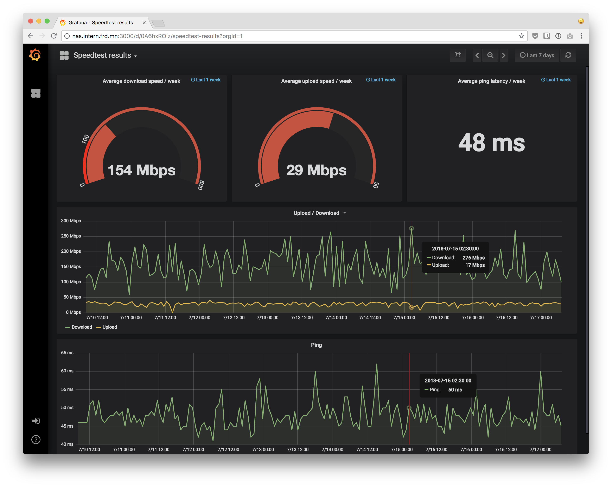
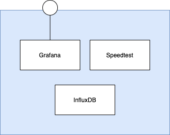
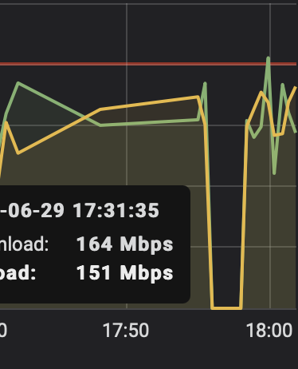

# home.server.docker-compose

A network monitor for my home network. Based on docker-compose and Ansible. It uses ideas and code from [frdmn/docker-speedtest-grafana](https://github.com/frdmn/docker-speedtest-grafana).



## Overview

The goal is to have a monitoring of the internet access as I would want it on my small home server. All this packaged in a Docker Compose. And easy to deploy on a fresh Unix server thru an Ansible script.

In a first version, these are the components I have integrated:



At a later stage I could add monitoring of my FritzBox, logging the ping time to google and may be more.

## Getting started

As a first step, make sure the file `hosts` points to the machine you want to provision (i.e. your home server or a local VM if you are testing). To get a starting point you can `cp hosts.sample hosts` and then edit the `hosts` file.

In order to deploy the services, these are the commands that need to be executed:

```bash
# Install the required roles (only needed to run once or if requirements changed)
ansible-galaxy install -r requirements.yml 
ansible-galaxy collection install -r requirements-collections.yml

ansible-playbook setup.yml 
```

Once the infrastructure (i.e. the docker daemon) is installed on the server and you only want to push modifications: 

```bash
ansible-playbook setup.yml --tags deploy
```

In order to see what's happening on the server:

```bash
ssh <Server IP or name>

# To follow the changes 'real time' I usually have one terminal like so:
watch docker ps

```

Once the services are running, Grafana can be accessed in the browser at `http://<IP Address of the server>:80`.

## Configuration

Configurations can be made in the `vars/all.yml` file and are pretty self explanatory.

## Further features

Features I would like to have and ToDos:

* **Build images**: The `docker-compose` file now has a `build` section, and builds the speedtest docker image when launched. This way we can add / modify functionality in the `index.js` node script and see it reflected rigth after start.
* **Properly see network drop outs**: When my network stops working, I now return 0-values, so I can recognize drop-outs in the graph like so: 

## Future features

* **Use variables for paths**, so it can also be executed on my local Mac w/o polluting it.
* **Add round trip to Google**: Another way than speedtest to measure latency is pinging google. And as it is far less heavy than using speedtest, I could add this measurement.
* **Monitor the server itself**: In order to have a real monitoring of my home infrastructure, I should add some metrics of my server on which the docker-compose setup is running: Processor, disk space, memory usage...
* **Monitor Fritz!Box**, especially the data volume bein up- and downloaded.
* **Show logs of all dockers** in an easy way, i.e. something similar to `docker logs all`.

## Testing 

In order to test my Ansible scripts, I use locally running VM using [multipass](https://multipass.run) from Ubuntu: It worked best for me in order to easily get fresh instances up and running in order to test my Ansible scripts.

See here for my [Multipass Cheatsheet](multipass_cheatsheet.md) and for a [guide for testing the Ansible scripts with multipass](test_with_multipass.md).

## Reading

Related and unrelated...
* An interesting thought: Do I need `docker-compose` or can I use plain Ansible? See [this article](https://www.ansible.com/blog/how-i-switched-from-docker-compose-to-pure-ansible).
* A [Promise-based JavaScript FRITZ!Box API.](https://github.com/FlorianWendelborn/fritz-box) - although I am not sure it picks up the data I am most interested in: The actual up- and download volume.
* [FRITZBOX MONITORING MIT GRAFANA DASHBOARD, May 2021](https://blog.unixweb.de/fritzbox-monitoring-mit-grafana-dashboard/): A good article, but also uses the GO Fritz-Box Exporter. But references a nice Grafana Dashboard for FritzBox-Data.
* [How to create a sudo user on Ubuntu and allow SSH login](https://thucnc.medium.com/how-to-create-a-sudo-user-on-ubuntu-and-allow-ssh-login-20e28065d9ff)
* [Using VirtualBox in Multipass on macOS](https://multipass.run/docs/using-virtualbox-in-multipass-macos)
* [Building, saving, and loading container images with Ansible - redhat, July 2020](https://www.redhat.com/sysadmin/container-images-ansible) explains nicely how to build on a remote host and how to export & import images.
* [Increase VirtualBox Disk Size](https://linuxhint.com/increase-virtualbox-disk-size/) (after having resized the Virtual Disk with VirtualBox)
* A good showcase using Ansible and Docker Compose: [Ansible-Tutorial: Setup von Docker, MySQL und WordPress mit Ansible [aktualisiert 2020]](https://www.happycoders.eu/de/devops/ansible-tutorial-setup-docker-mysql-wordpress/)
* A fully functioning [Speedtest / InfluxDB / Grafana setup](https://github.com/frdmn/docker-speedtest-grafana)
* [geerlingguy's role](https://github.com/geerlingguy/ansible-role-kubernetes)
* A [tutorial video by Nana](https://www.youtube.com/watch?v=EQNO_kM96Mo&t=828s). And check the [Gitlab Repo](https://gitlab.com/nanuchi/youtube-tutorial-series/-/tree/master/demo-kubernetes-components) that goes with the tutorial and contains all the samples.

